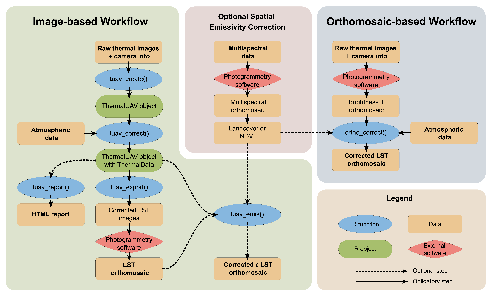

<!-- README.md is generated from README.Rmd. Please edit that file -->

```{r, include = FALSE}
knitr::opts_chunk$set(
  collapse = TRUE,
  comment = "#>",
  fig.path = "man/figures/README-",
  out.width = "100%"
)
```

# theRmalUAV

<!-- badges: start -->
<!-- badges: end -->

## 1. Overview

The goal of theRmalUAV is to clean and correct raw thermal UAV data.

There are two workflows that can be followed:

A) **Image-based Workflow:** to perform corrections at image level
B) **Orthomosaic-based Workflow:** to perform corrections on an orthomosaic containing uncorrected at-sensor temperatures

```{r, echo = F, figures-side, fig.show="hold",out.width="100%"}

```


## 2. Installation

#### theRmalUAV

theRmalUAV is not on CRAN (yet). You can install the development version of `theRmalUAV` from GitHub:

Note: Windows users need RTools to build packages from source files (which is basically what you do when you install from GitHub). RTools is not a R package, rather its a set of utilities that you install separately. You can download and install RTools from https://cran.r-project.org/bin/windows/Rtools/. Alternately, you can install RTools from within R by running:

``` r
install.packages('installr')
installr::install.Rtools()
```
After RTools is installed, you can install `theRmalUAV` from GitHub

``` r
## install.packages('remotes')
remotes::install_github("christophemetsu/theRmalUAV")
```
#### Dependent Packages

`theRmalUAV` requires several dependent packages, including fs, progress, rmarkdown, svDialogs, terra, tiff, and others (see the `DESCRIPTION` file for a complete list). Normally missing packages are installed at the same time, but if you get an error message about a missing package(s), install the dependent packages separately (i.e., from the ‘Packages’ pane in RStudio) then run remotes::install_github("christophemetsu/theRmalUAV", dependencies=FALSE).

##### exiftool

To read the EXIF data from the image files, `theRmalUAV` requires an external command line tool called ‘exiftool’.

UPDATE: As of version 1.6.0, you no longer need to manually install the exiftool command line utility. Rather you can install by running:

``` r
exiftoolr::install_exiftool()
```

To verify it worked:
``` r
exiftoolr::exif_version()
#> Using ExifTool version 12.50
#> [1] "12.50"
```

Alternately, you can install exiftool manually by downloading it from http://www.sno.phy.queensu.ca/~phil/exiftool/. Be sure to unzip it to a folder on the path (e.g, c:\windows) and rename the executable file from exiftool(-k).exe to exiftool.exe.


## 3. Supported thermal sensors

To obtain a table of available thermal sensor which you can use, run `tuav_cameras()` with no argument. If your sensor is not listed, you may submit an issue on GitHub to have it added. For details see the help page (?tuav_cameras) or contact the package author.

``` r
tuav_cameras()
```


