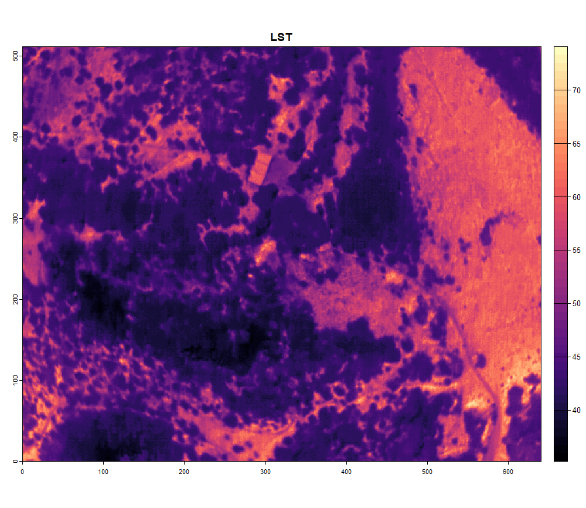

<style>
body {
text-align: justify}
</style>

```{r, include = FALSE}
knitr::opts_chunk$set(
  collapse = TRUE,
  comment = "#>"
)
```

In this article we will discuss the prerequisites to use the R package for processing DJI thermal cameras.

# 1. Setup and initialize

The thermal images from DJI cameras are stored in their own specific way. For a start they are written as JPG files instead of tiff. Furthermore, the DN values in these thermal images cannot be readily converted to temperatures. This conversion is limited to the DJI software. However, DJI released a Thermal SDK with Dynamic Link Libraries which can be incorporated into your code to process DJI thermal images. On big remark: these can only be accessed on a Windows or Linux system... In this R package the Thermal SDK is built in as well. To access the libraries, the package runs a python script in the background. So, before we can process DJI data, you first need to [download and install a version of Python](https://www.python.org/downloads/) on your pc. 

Once Python is installed, a virtual environment should be established in order to work with python through R. The package is dependent on the package `Reticulate` to link R with Python. You can hust run the function `dji_init()` to initialize this virtual environment.


```{r setup}
library(theRmalUAV)
```

```{r, include = TRUE, warning=FALSE, error=FALSE, message=FALSE, results='hide', eval=FALSE}
dji_init()
```

# 2. Create a ThermalUAV

If your have a DJI camera that is compatible with this package (check through `tuav_cameras()`), you have two options:
  - Follow the image-based workflow 
  - Process the data with the DJI IR Processing tool (dirp)

In the first case I gladly refer to the vignette about the image-based workflow. In this article we discuss the second option. The DJI IR processing tool is built into the function `tuav_dji()`. This function processes the data using the provided libraries from DJI. The input variables are thus the same as in their [DJI Thermal Analysis Tool software](https://www.dji.com/be/downloads/softwares/dji-dtat). To keep the geotags and facilitate the process, first a ThermalUAV object should be created before using the `tuav_dji()`.

```{r, include = TRUE, eval=FALSE}
thermal_uav_dji_M3T <- tuav_create(path = "E:/Thermal_Project/Thermal_data_dji/DJI_20240806165425_0078_T.JPG",
                               # ThermalUAV objects can also consist of only 1 image if desired
                               camera = "DJI_M3T",
                               meta_csv = NA,
                               flight_height = 75)
```


# 3. Process with DJI IR Processing tool

Once this ThermalUAV object is created, you can call the function `tuav_dji()`. Please check carefully the range in which each parameter should be provided.

```{r, include = TRUE, eval=FALSE}
dji_M3T <- tuav_dji(thermal_uav_dji_M3T,
                    obj_dist = 25,      # limited to [1-25] in meter
                    rel_hum = 47.2,     # should be between [20 - 100] in %
                    emissivity = 0.985,
                    refl_temp = 5,
                    return = TRUE,
                    export = FALSE,
                    export_path = NA)
```

When processed, you can plot your image:

```{r, include = TRUE, warning = FALSE, message=FALSE, results='hide', fig.keep = "none", eval=FALSE}
library(terra)
LST_dji_M3T <- rast(dji_M3T)
plot(LST_dji_M3T, main = "LST", col = map.pal("magma"))
```
```{r, echo = F, fig.show="hold",out.width="100%", dpi=300}

```


