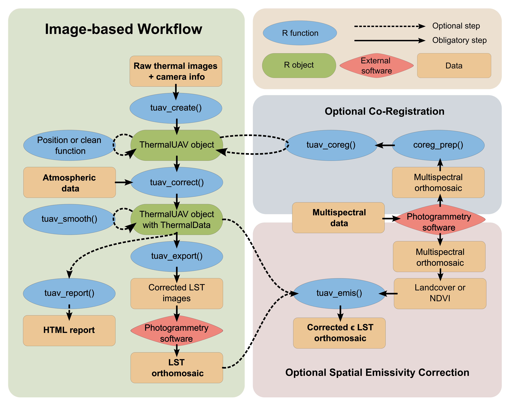
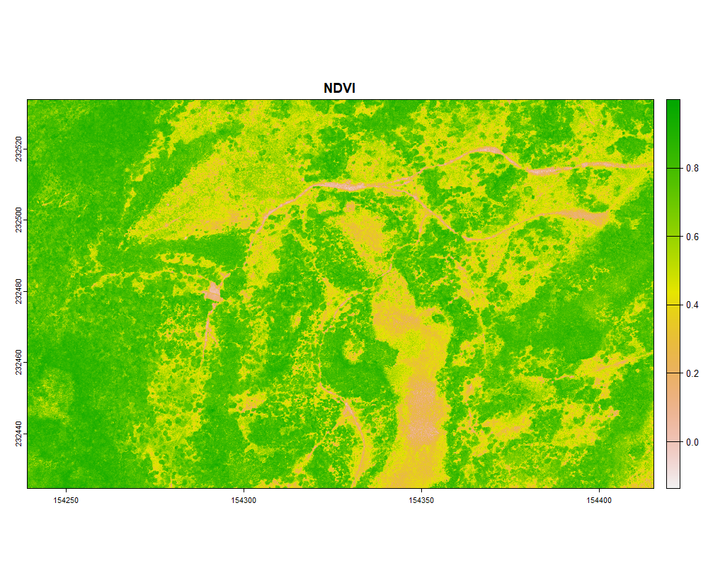
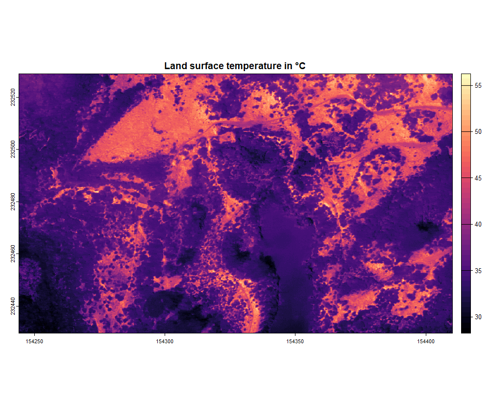
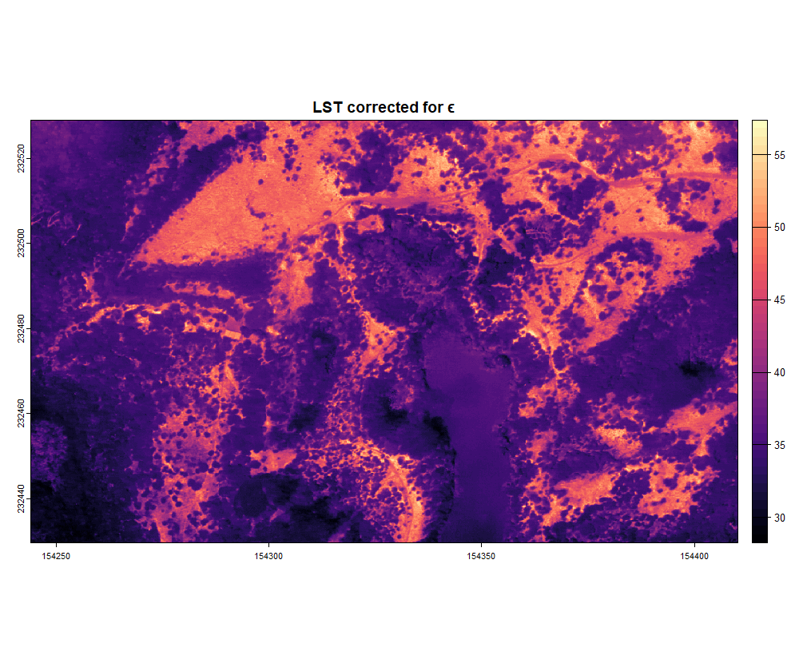
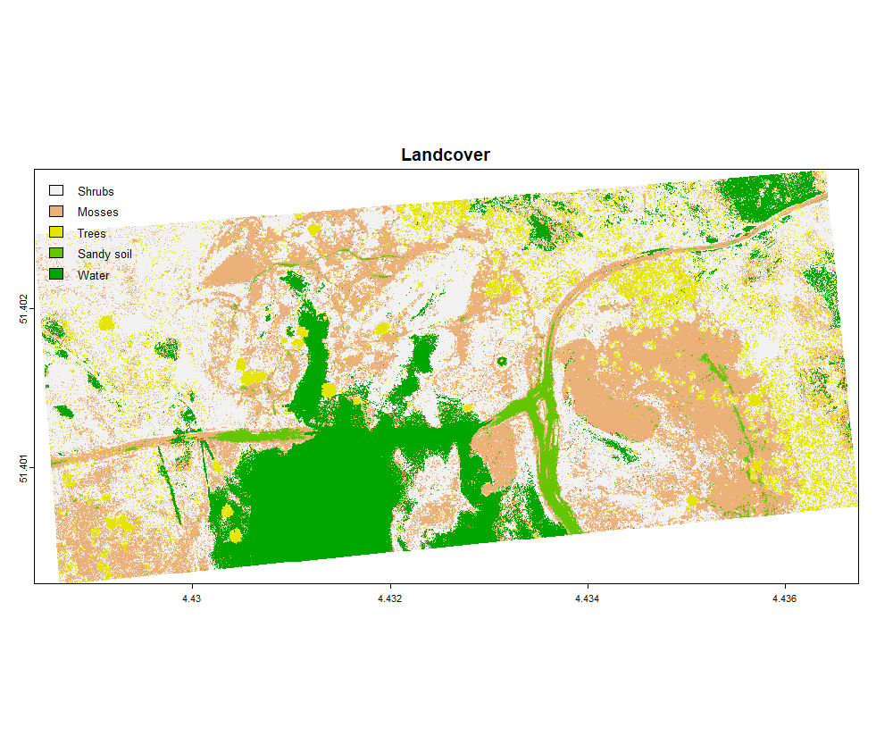
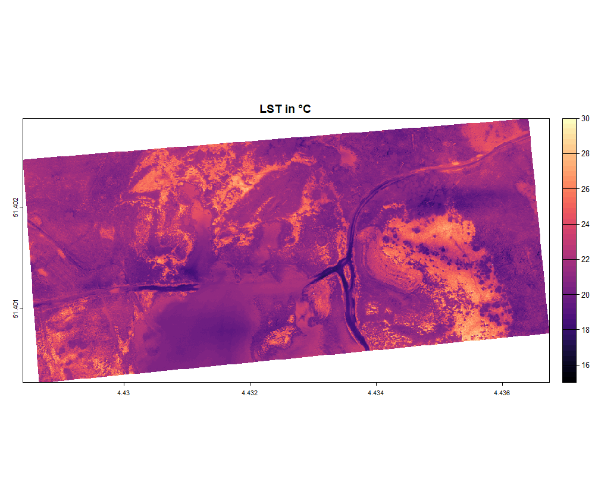
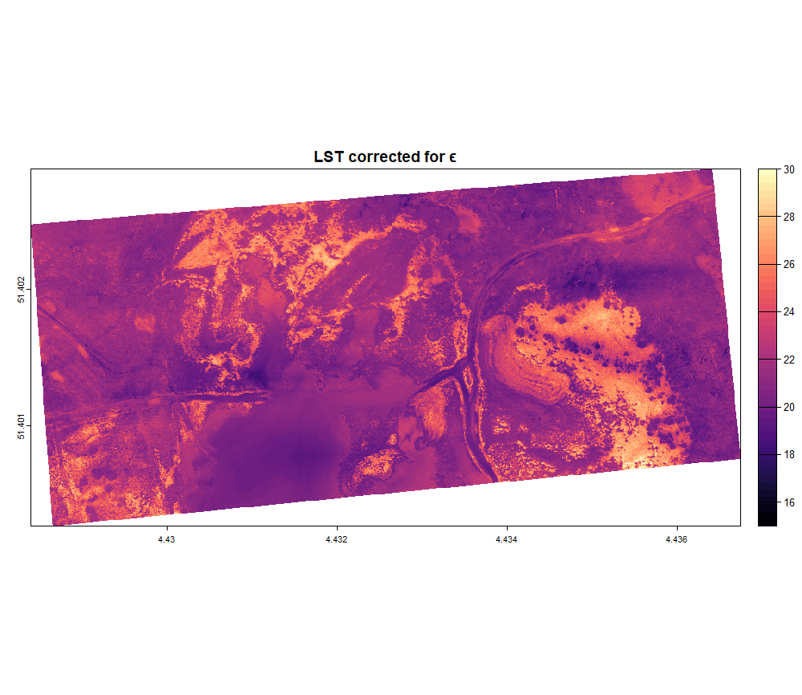

<style>
body {
text-align: justify}
</style>


```{r, include = FALSE}
knitr::opts_chunk$set(
  collapse = TRUE,
  comment = "#>"
)
```

# 1. Overview

In this article we will go over the image-based workflow step by step. The image-based workflow is intended to perform corrections at image level. The following figure provides a more detailed overview of the image-based workflow, indicating additional functionalities. The different steps will be explained suing two examples:

  - [2. Basic workflow with DJI Matrice 3T]
  - [3. Advanced workflow with TeAx ThermalCapture 2.0] 

```{r, echo = F, figures-side, fig.show="hold",out.width="100%"}

```

# 2. Basic workflow with DJI Matrice 3T

First things first, before we start we need to load the R package in our environment:

```{r, include=TRUE}
library(theRmalUAV)
```
Once this is complete we can call the functions embedded in the R package

When using DJI cameras in the image-based workflow, the package utilizes the DJI Thermal SDK functionality provided by DJI. The package uses a c++ function `get_temp_dirp_cpp()` (through Rcpp) in the background to access the libraries provided by DJI. 

## 2.1. Create a ThermalUAV object

The image-based workflow always starts with creating a ThermalUAV object using the function `tuav_create()`. Here we will give the name "thermal_uav" to the ThermalUAV object. The path refers to the path on your pc to the folder containing the TIFF/jpg files, or path to 1 TIFF/jpg file. The camera name can be found by running the function `tuav_cameras()`. The flight_height is our case 75 meters. No external metadata dataframe is available so we set it to NA, this way only the meta data stored in exif will be used.
```{r, include = TRUE, warning=FALSE, message=TRUE, eval=FALSE}
thermal_uav <- tuav_create(path = "E:/Thermal_Project/Thermal_data_dji",
                           camera = "DJI_M3T",
                           meta_csv = NA,
                           flight_height = 75)
```
## 2.2. Conversion to LST

After creating the ThermalUAV you can already correct the data using the function `tuav_correct()`. Here, atmospheric data is required, use the expression "?tuav_correct()" to check which formats can be used. In this example we keep it simple and will only use one value for each atmospheric parameter, as the flight was relatively short and was performed under stable weather conditions. The values were measured using the portable Kestrel 5000 weather station. The parameter flight_height is set to NA to use the height as defined in `tuav_create()`. Emissivity is set to 0.985, a commonly used value for vegetation. To obtain the background temperature `T_bg` in Kelvin, the brightness temperature of crumpled aluminium foil was used.
```{r, include = TRUE, warning = FALSE, eval=FALSE}
thermal_uav_correct <- tuav_correct(thermal_uav,          
                                    flight_height = NA,   # in meters
                                    T_air = 28.7,         # in °C
                                    rel_hum = 47.2,       # in %
                                    T_bg = 282.37,        # in Kelvin
                                    emiss = 0.985)        
```

## 2.3. Export and report

Now the most basic, essential correction is done, and we can export the data to convert the images into a LST orthomosaic. To export the data, use the function `tuav_export()`. Make sure you use the most up-to-date ThermalUAV object, holding the thermal information and latest corrections. Set `export_path` if you want to store the data somewhere specific. Here we use the default 'NA', to create a new folder, names "corrected",  within the original folder. 
```{r, include = TRUE, warning = FALSE, eval=FALSE}
tuav_export(thermal_uav_correct,
            export_path = NA)     
```

Optionally, if desired, you can also create an HTM-report using `tuav_report()`:
```{r, include = TRUE, warning = FALSE, eval=FALSE}
tuav_report(thermal_uav_correct,
            project_name = "Thermal_Project_DJI",
            flight_name = "Flight 1",
            pilot_name = "Pilot X",
            location = "Flightblock Y")     
```

## 2.4. Optional Spatial Emissivity Correction

After stitching the exported corrected LST tiff files, you obtain a LST orthomosaic. This LST map assumes one emissvivty value for the whole area. If you flew over a region with a lot of different land covers, some parts might be over/under estimated due to a wrong emissivity value. For example, the thermal emissivity for bare soil, vegetation and water differ. You can account for this using the NDVI threshold method, a landcover (LC) map or directly through an emissivity map if available see vignette("Background") for more information. The NDVI, LC or emissvity map does not necessarily have to be taken at the same day or resolution. However, it must completely cover the LST orthomosaic. 

In this example we will use the NDVI threshold method. The multispectral (MSP) data was obtained using the Micasense Altum-PT on the same day and processed in Agisoft Metashape using [this workflow](https://agisoft.freshdesk.com/support/solutions/articles/31000148381-micasense-altum-processing-workflow-including-reflectance-calibration-in-agisoft-metashape-professi). The reflectance was calibrated using a 50% calibration panel. The MSP orthomosaic is first loaded to create an NDVI map. You can use the [terra package](https://rspatial.github.io/terra/) to work with rasters in R. 

```{r, include = TRUE, warning = FALSE, results='hide', fig.keep = "none", eval=FALSE}
library(terra)

# Load the MSP data as SpatRaster
MSP <- rast("E:/Thermal_Project/MSP_ortho_dji.tif")
# Create NDVI using the NIR and RED band
NDVI <- (MSP$NIR - MSP$RED)/(MSP$NIR + MSP$RED)
names(NDVI) <- "NDVI"

# Load the LST data as SpatRaster
LST <- rast("E:/Thermal_Project/LST_ortho_dji.tif")

# Plot the data
par(mfrow = c(2, 1))
plot(NDVI, main = "NDVI")
plot(LST, main = "Land surface temperature in °C", col = map.pal("magma"))
```
```{r, echo = F, fig.show="hold",out.width="100%", dpi=300}

```
```{r, echo = F, fig.show="hold",out.width="100%", dpi=300}

```

Once the NDVI map is created, we can account for the emissivity in a spatially explicit way using the NDVI threshold method. In this example we are going to set tho following parameters, the emissivity values were taken from [this paper](https://doi.org/10.1016/S0034-4257(96)00123-X): 
- NDVI<sub>veg</sub> = 0.8
- NDVI<sub>soil</sub> = 0.1
- ϵ<sub>veg</sub> = 0.984 (Emissivity for shrubs)
- ϵ<sub>soil</sub> = 0.914 (Emissivity for sandsoils)

```{r, include = TRUE, warning = FALSE, results='hide', fig.keep = "none", eval=FALSE}
LST_emis <- tuav_emis(thermal_orig = LST,
                      thermal_uav = thermal_uav_correct, # The last ThermalUAV object, 
                      temp = "C", # LST is in this case in °C
                      corrmap = NDVI,
                      method = "NDVI", # Here we use the NDVI method
                      write_Ts = TRUE, # If you want to write the output
                      filename_Ts = "E:/Thermal_Project/LST_ortho_dji_emis.tif",
                      write_emiss = TRUE, # Optionally you can save the emissivity raster file
                      filename_emiss = "E:/Thermal_Project/Emis_ortho_dji.tif",
                      NDVI_veg = 0.8,
                      NDVI_soil = 0.1,
                      emiss_veg = 0.984,
                      emiss_soil = 0.914)
```
After correcting for the spatially explicit emissivity, the LST map is final and can be plotted or used for your analysis. Please note, in this example a small part is covered by water. The emissivity of water is slightly higher than that for shrubs. Careful interpretation of the water temperatures is thus required. 
```{r, include = TRUE, warning = FALSE, results='hide', fig.keep = "none", eval=FALSE}
plot(LST_emis, main = "LST corrected for ϵ", col = map.pal("magma"))
```
```{r, echo = F, fig.show="hold",out.width="100%", dpi=300}

```

# 3. Advanced workflow with TeAx ThermalCapture 2.0

In this example we will dive into a more advance case using the ThermalCapture 2.0. This thermal camera records at 8.33 Hz, meaning we have slightly more than 8 thermal images per second. We will discuss how you can reduce the data volume in an efficient way, while retaining maximal quality. Furthermore, we will discuss how the co-registration works, in this case with the Micasense Altum-PT. As the flight in this example is quite long covering 17 ha, we will use atmospheric data recorded at high frequency. But, first things first, we have to create a ThermalUAV object.

## 3.1. Create a ThermalUAV object

As in section [2.1. Create a ThermalUAV object] we will create a ThermalUAV object using the function `tuav_create()`. The ThermalCapture line from TeAx, stores thermal data as a ".TMC" file. They provide a software called ThermoViewer to convert the TMC files into TIFF files containing the thermal data. This software provides the option to store the metadata of all images in ONE csv file. This csv file can be used as additional meta data in the `tuav_create()` function.

```{r, include = TRUE, warning=FALSE, message=TRUE, eval = FALSE}
thermal_uav_teax <- tuav_create(path = "E:/Thermal_Project/Thermal_data_TeAx/",
                                camera = "ThermalCapture",
                                meta_csv = "E:/Thermal_Project/Thermal_data_TeAx/Thermal_Project_meta.csv",
                                flight_height = 75)
```
## 3.2. Check and clean the data

The data volume is quite high (16612 images) as you can see with the following code:

```{r, include = TRUE, warning=FALSE, message=TRUE, eval=FALSE}
thermal_uav_teax@Info@dataset_length                           
```
You can also check the visually where all these images are located in space using the following code:
```{r, include = TRUE, warning=FALSE, message=TRUE, fig.show="hold",out.width="100%", dpi=300, eval = FALSE}
thermal_uav_teax_loc <- tuav_loc(thermal_uav_teax,
                                 extent = TRUE,   # Calculate the image extents
                                 overlap = TRUE)  # Calculate the mean frontal overlap

thermal_uav_teax_loc@Position@overlap
tuav_view(thermal_uav_teax_loc, extent = TRUE)
```


If all these images need to be converted, it might require a lot of computing power. Generally, we also don't need around 8 images per second, resulting in a mean frontal overlap of 98.7 %. This R package offers two functions to deal with data reduction. Either you keep a predefined amount of images per second using `tuav_persec()`, or you set a minimal threshold for overlap or sharpness with `tuav_reduc()`. You can call "?tuav_reduc" to get more information on the function's parameters. Here we will use the method overlap, which means the algorithm will select images to result in a frontal overlap of the given value (in this case 0.9 for a frontal overlap of 90%). The algorithm will only select images with enough quality (i.e. above the sharpness_threshold). If this latter requirement is not met, it will take the best option below this threshold to still ensure the minimal required overlap. In this case, it will provide a list on which images where kept, but do not meet the required quality checks. Lastly, you have the option to delete the images from your local storage (be careful with this option), or you can just move the images to a different folder (= DEFAULT).

```{r, include = TRUE, warning=FALSE, message=TRUE, eval = FALSE}
thermal_uav_teax_clean <- tuav_reduc(thermal_uav_teax_loc,
                                     method = "Overlap",
                                     min_overlap = 0.9,
                                     sharpness_threshold = 0.05,
                                     remove = FALSE)
```
You can see that the mean frontal overlap is reduced and visualize it with the interactive map:

```{r, include = TRUE, warning=FALSE, message=TRUE, fig.show="hold",out.width="100%", dpi=300, eval = FALSE}
thermal_uav_teax_clean@Position@overlap
tuav_view(thermal_uav_teax_clean, extent = TRUE)
```

## 3.3. Co-regsitration with Micasense Altum-PT 

The ThermalCapture 2.0 is a standalone camera with its own GPS and power supply (does not get information from the UAV). In our sensor-platform configuration it is used together with the Micasense Altum-PT, which receives RTK GPS signals from our UAV (DJI Matrice 300 RTK). The ThermalCapture's GPS information is only used to derive accurate timestamps. Subsequently, the accurate timestamps can then be used to retrieve the corresponding RTK GPS signal from the Micasense Altum-PT through interpolation. The co-registration has two options:
 - Directy: use the GPS and orientation data from the co-registered camera directly
 - Indirectly: First, align the cameras from the co-registered camera in Agisoft Metashape, export the optimized camera locations as csv file and these optimized GPS and orientation data. 

In Both cases we first need to call the `coreg_prep()` to prepare the data in the right format:

```{r, include = TRUE, warning=FALSE, message=TRUE, results='hide', eval=FALSE, eval = FALSE}
opt_cameras <- coreg_prep(img_path = "E:/Thermal_Project/data_Micasense/",
                          SfM_option = "Agisoft Metashape",
                          opt_camera_path = "E:/Thermal_Project/Reference_Cameras_Thermal_Project.txt",
                          camera_name = "Altum-PT_MSP",
                          label = "_2",
                          timezone = "UTC")
```
This should have returned a data.frame with 9 variables. We can now use this in the `tuav_coreg()` function.

```{r, include = TRUE, warning=FALSE, message=TRUE, results='hide', eval=FALSE, eval = FALSE}
thermal_uav_teax_coreg <- tuav_coreg(thermal_uav_teax_clean,
                                     opt_cameras = opt_cameras,
                                     rig_offset = c(0, 0, 0, 0, 0, 0),
                                     timediff = 0)
```
Optionally you can call the `tuav_view()` function again on the latest ThermalUAV object to check if the camera locations are still places correctly (serves as quick visual check).

## 3.4. Conversion to LST

If you are satisfied with the performed corrections, we can now move to the conversion of the brightness temperature to LST. Note, the cleaning functions can also be performed after this step, but it will require much longer computation time. As explained in [2.2. Conversion to LST], we use the function `tuav_correct()` to perform the conversion.

During this rather long flight, weather variables were collected simultaneous at a 5-second interval rate using the Kestrel 5500. This data first needs to be loaded an put into the right format. you can chekc the structure using the `str()` function. Datetime, can be easily converted to POSIXct using `as.POSIXct()`.

```{r, include = TRUE, warning = FALSE, eval = FALSE}
Kestrel <- read.csv("E:/Thermal_Project/Weather_data/Kestrel_tair_relhum.csv")
str(Kestrel)      # datetime is as character -> convert to POSIXct
Kestrel$datetime <- as.POSIXct(Kestrel$datetime, tz = "UTC")
```
After obtaining the data.frame in the right format, it can be used in the `tuav_correct()` function

```{r, include = TRUE, warning = FALSE, results='hide', eval=FALSE}
thermal_uav_teax_correct <- tuav_correct(thermal_uav_teax_coreg,          
                                    flight_height = NA,   # in meters
                                    T_air = Kestrel,      # data.frame in °C
                                    rel_hum = Kestrel,    # data.frame in %
                                    T_bg = 268.26,        # in Kelvin
                                    emiss = 0.985)        
```

## 3.5. Smooth

Optionally an additional smoothing procedure can be applied to avoid the influence of large fluctuations in T_air on the dataset. This smoothing correction is based on the following formula from [this paper](https://doi.org/10.3390/rs9050476):

$$
\begin{align*}
T_{S_{smooth}} = T_{s} - T_{air} + T_{air_{mean}} 
\end{align*}
$$ 

```{r, include = TRUE, warning = FALSE, results='hide', eval=FALSE}
thermal_uav_teax_smooth <- tuav_smooth(thermal_uav_teax_correct,          
                                    method = "T_air")        
```

## 3.6. Export and report

Now we are back at the point where we need to export the images and process them in an external photogrammetry software like Agisoft Metashape. Check section [2.3. Export and report] for more details.

```{r, include = TRUE, warning = FALSE, results='hide', eval=FALSE}
tuav_export(thermal_uav_teax_smooth,
            export_path = NA)     
```

Optionally, if desired, you can also create an HTM-report using `tuav_report()`:
```{r, include = TRUE, warning = FALSE, results='hide', eval=FALSE}
tuav_report(thermal_uav_teax_smooth,
            project_name = "Thermal_Project_TeAx",
            flight_name = "Flight 1",
            pilot_name = "Pilot X",
            location = "Flightblock Y")     
```

## 3.7. Optional Spatial Emissivity Correction

In section [2.4. Optional Spatial Emissivity Correction] we already discussed the option to account for spatially explicit post-processing emissivity correction. In the previous example we used the NDVI threshold method. In this case we will show the landcover option. This option requires:

A) Landcover map (LC)
B) Two column matrix containing the landcover labels with their corresponding emissivity values

In the example below, a LC map is provided with 5 classes as shown in the table below:

| Label	  | Class                       |	Emissivity |
| ------- | --------------------------- | ---------- |
| 1       |	Shrubs/green low vegetation	| 0.984      |
| 2	      | Dry vegetation/mosses	      | 0.962      |
| 3       | Trees                       | 0.983      |
| 4       | Sandy bare soil             | 0.914      |
| 5       | Water                       | 0.991      |
  
The emissivity values were taken from Salisbury and D’Aria (1994) and Rubio, E., et al. (1997). First we will load the LC map and create the two-column matrix containing the labels with their corresponding emissivity value.

```{r, include = TRUE, warning = FALSE, results='hide', fig.keep = "none", results='hide', eval=FALSE}
# Load the LC map as SpatRaster
LC <- rast("E:/Thermal_Project/LC_TeAx.tif")
# Create two-column matrix 
matrix <- matrix(c(1,2,3,4,5,0.984,0.962,0.983, 0.914,0.991), ncol = 2)

# Load the LST data as SpatRaster
LST_teax <- rast("E:/Thermal_Project/LST_TeAx.tif")

# Plot the data
par(mfrow = c(2, 1))
plot(LC, main = "Landcover", type = "classes", levels = c("Shrubs", "Mosses", "Trees", "Sandy soil", "Water"), legend = "topleft")
plot(LST_teax, main = "LST in °C", col = map.pal("magma"), range = c(15,30))
```

```{r, echo = F, fig.show="hold",out.width="100%", dpi=300}

```
```{r, echo = F, fig.show="hold",out.width="100%", dpi=300}

```

```{r, include = TRUE, warning = FALSE, results='hide', eval=FALSE}
LST_teax_emis <- tuav_emis(thermal_orig = LST_teax,
                      thermal_uav = thermal_uav_teax_smooth, # The last ThermalUAV object, 
                      temp = "C", # LST is in this case in °C
                      corrmap = LC,
                      method = "LC", # Here we use the LC method
                      write_Ts = TRUE, # If you want to write the output
                      filename_Ts = "E:/Thermal_Project/LST_TeAx_emis.tif",
                      write_emiss = TRUE, # Optionally you can save the emissivity raster file
                      filename_emiss = "E:/Thermal_Project/Emis_ortho_TeAx.tif",
                      LC_emiss_matrix = matrix)
```

After correcting for the spatially explicit emissivity, the LST map is final and can be plotted or used for your analysis. 

```{r, include = TRUE, warning = FALSE, results='hide', fig.keep = "none", eval=FALSE}
plot(LST_teax_emis, main = "LST corrected for ϵ", col = map.pal("magma"), range = c(15,30))
```
```{r, echo = F, fig.show="hold",out.width="100%", dpi=300}

```


# References

- Salisbury, J.W. and D’Aria, D.M. (1994) ‘Emissivity of terrestrial materials in the 3-5 μm atmospheric window’, Remote Sensing of Environment, 47(3), pp. 345–361. Available at: https://doi.org/10.1016/0034-4257(94)90102-3.
- Rubio, E., Caselles, V. and Badenas, C. (1997) ‘Emissivity Measurements of Several Soils and Vegetation Types in the 8-14/ m Wave Band: Analysis of Two Field Methods’, Remote Sensing of Environment, 59(3), pp. 490-521. Available at: https://doi.org/10.1016/S0034-4257(96)00123-X 
