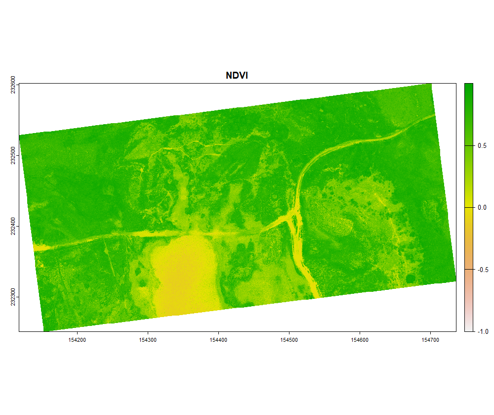
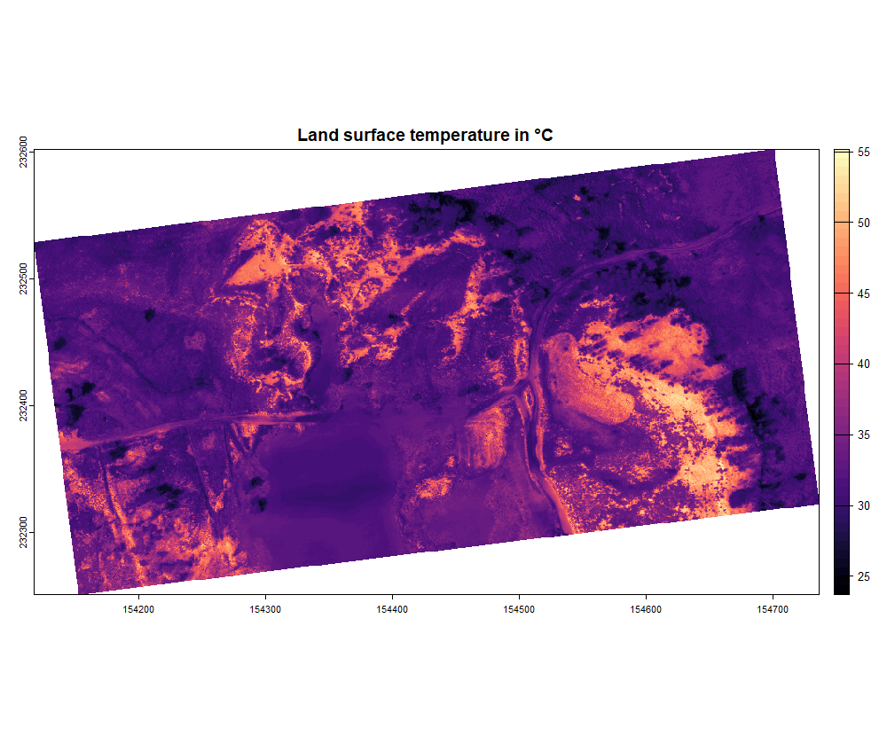

<style>
body {
text-align: justify}
</style>


```{r, include = FALSE}
knitr::opts_chunk$set(
  collapse = TRUE,
  comment = "#>"
)
```


# 1. Overview

In this article we will go over the orthomosaic-based workflow step by step. The orthomosaic-based workflow is intended to perform corrections on an orthomosaic containing uncorrected brightness temperatures and is presented in the Figure bellow. We will showcase these steps with an example using the Micasense Altum-PT camera. This camera collects tiff images in the blue, green, red, red-edge, near-infrared, as well as the thermal infrared range. The thermal data is stored as centikelvin. 

```{r, echo = F, figures-side, fig.show="hold",out.width="100%", dpi=300}

```
# 2. Load the necessary data

First, the multiband data was stitched into a multispectral orthomosaic using Agisoft Metashape (other phogrammetry software is also possible), following [this workflow](https://agisoft.freshdesk.com/support/solutions/articles/31000148381-micasense-altum-processing-workflow-including-reflectance-calibration-in-agisoft-metashape-professi). This resulted in a multispectral orthomosaic with the reflectance in blue, green, red, red-edge and near infra-red, as well as temperature in °C. We first load the data and select the right bands for further processing.

```{r, include = TRUE, out.width = "100%", dpi=300, results='hide', fig.keep = "none", eval=FALSE}
library(theRmalUAV) # For thermal processing
library(terra)      # For working with rasters

MSP <- rast("E:/Thermal_Project/MSP_ortho_micasense.tif")
names(MSP) <- c("BLU", "GRE", "RED", "REG", "NIR", "TIR")
TIR <- MSP$TIR
NDVI <- (MSP$NIR - MSP$RED)/(MSP$NIR + MSP$RED)

par(mfrow = c(2, 1))
plot(NDVI, main = "NDVI")
plot(TIR, main = "Brightness temperature in °C", col = map.pal("magma"))
```
```{r, echo = F, fig.show="hold",out.width="100%", dpi=300}

```

```{r, echo = F, fig.show="hold",out.width="100%", dpi=300}

```

# 3. Conversion to LST 

Once the NDVI map is created, we can account for the emissivity in a spatially explicit way using the NDVI threshold method. In this example we are going to set tho following parameters, the emissivity values were taken from [this paper](https://doi.org/10.1016/S0034-4257(96)00123-X): 

  - NDVI<sub>veg</sub> = 0.8
  - NDVI<sub>soil</sub> = 0.1
  - ϵ<sub>veg</sub> = 0.984 (Emissivity for shrubs)
  - ϵ<sub>soil</sub> = 0.914 (Emissivity for sandsoils)

```{r, include = TRUE, eval=FALSE}
LST_correct <- ortho_correct(thermal_ortho = TIR,
                             temp = "C",         # Thermal map is in °C
                             flight_height = 75, # in meter
                             T_air = 18.6,       # in °C
                             rel_hum = 46.1,     # in %
                             T_bg = 286.65,      # in Kelvin
                             emiss = NA,
                             method = "NDVI",
                             corrmap = NDVI,
                             NDVI_veg = 0.8,
                             NDVI_soil = 0.1,
                             emiss_veg = 0.984,
                             emiss_soil = 0.914)
```

The function `ortho_correct()` returns a SpatRaster object. You can plot and export it as geotiff using the terra-package:

```{r, include = TRUE, warning = FALSE, out.width = "100%", dpi=300, results='hide', fig.keep = "none", eval=FALSE}
plot(LST_correct, main = "Land surface temperature in °C", col = map.pal("magma"))

writeRaster(LST_correct, "E:/Thermal_Project/LST_micasense.tif", overwrite = TRUE)
```

```{r, echo = F, fig.show="hold",out.width="100%", dpi=300}

```
